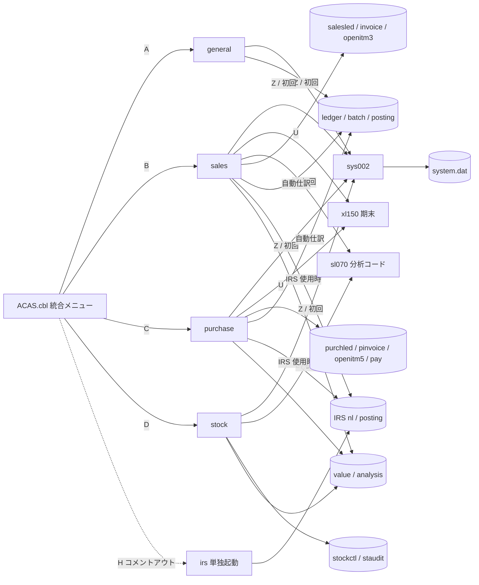
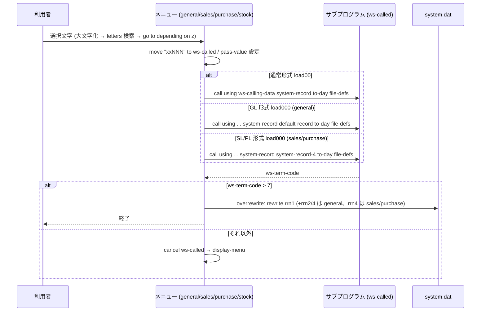
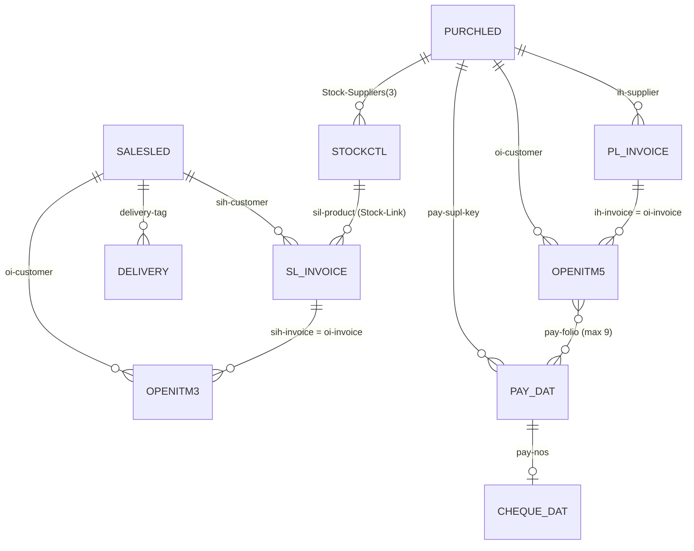
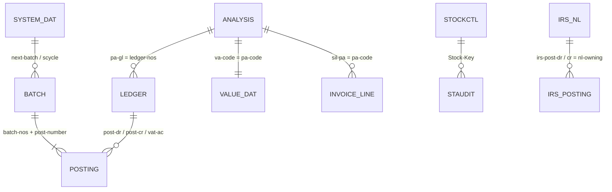
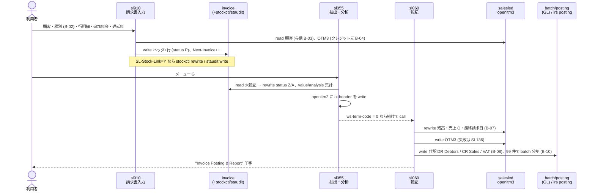
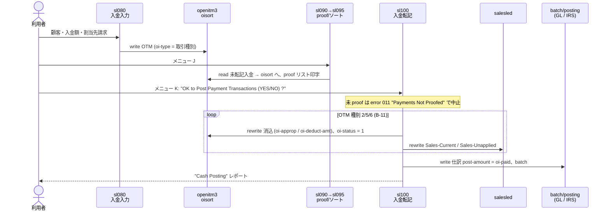
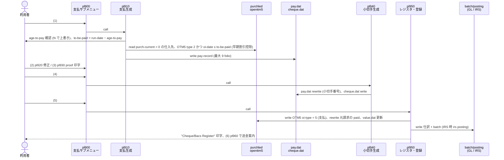
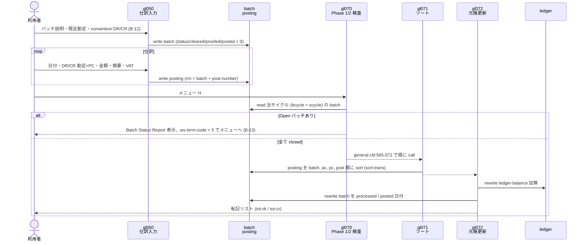
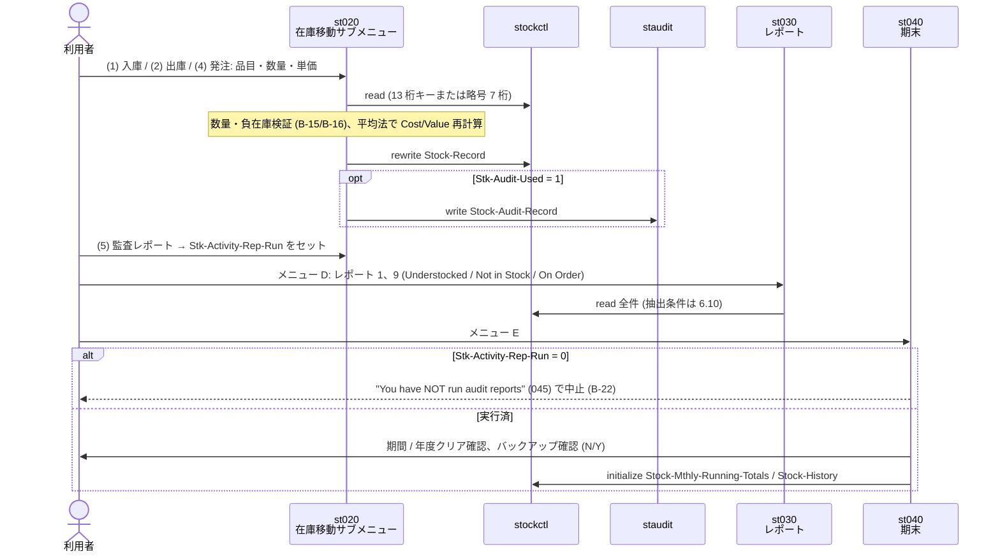

# ACAS 現行仕様書

## 1. 概要・対象範囲・前提

ACAS は GnuCOBOL (free format `>>source free`) で書かれた中小企業向け会計パッケージで、総勘定元帳 (GL)、売掛 (Sales Ledger, SL)、買掛 (Purchase Ledger, PL)、在庫 (Stock)、簡易帳簿 (Incomplete Records System, IRS) の 5 サブシステムから成る。各サブシステムは文字端末 (24 行 x 80 桁、`display ... at rrcc`) のメニュー駆動で動作し、データは ISAM 索引ファイル・相対ファイル・順ファイルに保存する。印刷は `prt-1` 等のスプールファイルに書き出し、`CALL "SYSTEM"` で `lpr` に渡す。

| 項目 | 内容 |
|---|---|
| 対象 | リポジトリ全体 (バージョン 3.01.x 系。`prog-name` に個別版数) |
| 読者・目的 | 移行・引き継ぎ用の凍結仕様。読者は開発者 |
| 根拠 | ソースコードのみ。実機 (GnuCOBOL 実行環境) は本環境に無く未確認 |
| 対象外 (言及のみ) | Order Entry / Payroll / EPOS (`ACAS.cbl` に "NOT on opensource")、`experimental-stuff/`、`*/RW-Programs` (Report Writer 版書き換え、ビルドスクリプト未参照)、`common/stockMT.cbl` (RDBMS DAL)、`st060` (取込テンプレート)、`acasconvert1` (旧形式変換) |
| ビルド | `comp-all.sh` → 各 `comp-*.sh`。メニュー実行体は `cobc -x`、サブプログラムは `cobc -m` (動的 CALL) |
| 環境変数 | `ACAS_LEDGERS` (GL/SL/PL/Stock データパス)、`ACAS_IRS` (IRS データパス)、`ACAS_BIN` (実行体パス)。各メニュー `zz020-Set-the-Paths` が `file-defs` に前置 |

**共通アーキテクチャ** — サブプログラムは先頭 2 引数 `ws-calling-data system-record` を共通とする 3 形式のリンケージで呼ばれる: (a) 通常形式 `... system-record to-day file-defs` (各メニュー `load00`)、(b) GL 形式 `... system-record default-record to-day file-defs` (`general.cbl:498-502` `load000`、gl020/gl050 等)、(c) SL/PL 形式 `... system-record system-record-4 to-day file-defs` (`sales.cbl:469-475` `purchase.cbl:470-474` `load000`)。各機能の形式はメニューの `load00`/`load000` 選択と呼出先 PROCEDURE DIVISION USING で照合すること。呼出先が `ws-term-code > 7` を返すとメニューは `overrewrite` に飛び、システムファイルを書き戻して終了する。`system.dat` (相対ファイル) の書戻し対象はメニューごとに異なる: general は rrn 1 (`system-record`、1024 バイト `copybooks/wssystem.cob`) / rrn 2 (`default-record`) / rrn 4 (`system-record-4`) (`general.cbl:455-462`)、sales・purchase は rrn 1 / 4 (`sales.cbl:426-431` `purchase.cbl:431-436`)、stock は rrn 1 のみ (`stock.cbl:441-443`)。共通部品は `maps01` (パスワード/名称エンコード)、`maps04` (日付検証・変換 `dd/mm/ccyy` ⇄ binary)、`maps09` (Mod 11 チェックデジット)、`maps99` (共通エラー表示) である。

## 2. 機能一覧

機能 ID は「サブシステム記号 + メニュー文字」で付与する (M = 統合メニュー、G = GL、S = SL、P = PL、K = Stock、I = IRS)。

| ID | 機能名 (画面表示文言) | 入口 | 主要ソース |
|---|---|---|---|
| M-ALL | ACAS System Menu (統合メニュー A〜G, X, Z) | `ACAS` 実行 | `ACAS.cbl` |
| G-A/S-A/P-A/K-A | Date Entry (業務日付入力・Start of Day) | 各メニュー A | `gl000` `sl000` `pl000` `st000` |
| G-B | Chart Of Accounts (勘定科目表保守) | general B | `gl030` |
| G-C | Default Account Maintenance | general C | `gl020` |
| G-E | Enter Transactions (仕訳入力・バッチ作成) | general E | `gl050` |
| G-F | Proof/Modify Transactions | general F | `gl051` |
| G-G | Batch Status Report | general G | `gl060` |
| G-H | Transaction Posting (バッチ検査→ソート→元帳更新) | general H | `gl070` `gl071` `gl072` |
| G-I | End Of Cycle Processing (期末・アーカイブ) | general I | `gl080` |
| G-J | Print Trial Balance (詳細 / PC 別) | general J | `gl090` `gl090a` `gl090b` |
| G-K | Print P&L and Balance Sheet | general K | `gl120` |
| G-L | Print Ledgers (プリソート→印字) | general L | `gl100` `gl105` |
| G-D/G-M | Final Accounts Set-Up / Print (*) | general D, M | 未実装 ("Sorry not yet available") |
| S-B | Customer File Maintenance (1〜6 サブメニュー) | sales B | `sl010` |
| S-C | Sales Ledger Enquiry | sales C | `sl020` |
| S-D/S-E | Sales Transactions Input / Amend (請求書入力・修正) | sales D, E | `sl910` `sl920` |
| S-F/S-G | Sales Transactions Proof / Post | sales F, G | `sl050` / `sl055`→`sl060` |
| S-H〜S-K | Payment Input / Amend / Proof / Post | sales H〜K | `sl080` `sl085` `sl090`→`sl095` `sl100` |
| S-L/S-M | Set-Up Sales Analysis Codes / Sales Analysis Report | sales L, M | `sl070` `sl130` |
| S-N | Sales Day Book | sales N | `sl140` |
| S-O/S-P/S-Q | Statement / Dunning Letters / Aged Debtors (共通ソート `sl115`) | sales O〜Q | `sl115`→`sl110` / `sl190` / `sl120` |
| S-R/S-S/S-V | Alphabetical Customer List / Turnover / File Dump | sales R, S, V | `sl165`→`sl160` `sl180` `sl170` |
| S-T | Invoice Sub-System (請求書サブメニュー 1〜9) | sales T | `sl900` `sl910`〜`sl960` |
| S-U/P-T | End of Cycle Processing (日計簿→期末処理) | sales U / purchase T | `sl140`/`pl140`→`xl150` |
| P-B/P-C | Supplier File Maintenance / Purchase Ledger Enquiry | purchase B, C | `pl010` `pl015` |
| P-D〜P-H | Purchase Transactions Input / Amend / Delete / Proof / Post | purchase D〜H | `pl020` `pl030` `pl040` `pl050` `pl055`→`pl060` |
| P-I〜P-L | Payment Input / Amend / Proof / Post | purchase I〜L | `pl080` `pl085` `pl090`→`pl095` `pl100` |
| P-M〜P-R | Analysis Codes / Analysis Report / Day Book / Aged Creditors / Alpha List / Turnover | purchase M〜R | `pl070` `pl130` `pl140` `pl165`→`pl115`→`pl120` `pl165`→`pl160` `pl170` |
| P-S | Cheque Sub-System (支払生成〜小切手・送金案内) | purchase S | `pl900` `pl910`〜`pl960` |
| P-U/P-V | Invoice Parameter Amend / Supplier File Dump | purchase U, V | `pl180` `pl190` |
| K-B | Stock Item Maintenance (1〜6 サブメニュー) | stock B | `st010` |
| K-C | Stock Movements (入庫・出庫・バーコード・発注) | stock C | `st020` |
| K-D | Reports (在庫レポート) | stock D | `st030` |
| K-E/K-Y | End of Cycle Processing / Stock File Compression | stock E, Y | `st040` `st050` |
| I-1〜I-9, I-A | IRS: System Set-Up, Accounts, Default A/Cs, Posting, Trial Balance, Audit Trail, Accounts Production, Posting Amendments, Analysis Report, Nominal File Fix up | irs 1〜9, A | `irs.cbl` `irs010`〜`irs090` |
| *-Z | System Setup (システムパラメータ保守) | 各メニュー Z | `sys002` |

## 3. 画面フロー

各サブシステムは独立した実行体 (`general`, `sales`, `purchase`, `stock`, `irs`) として起動でき、`ACAS` 統合メニューは各実行体を `call` するだけの薄い層である (`ACAS.cbl:395-437`)。メニュー選択は 1 文字入力 → 大文字化 → `letters` テーブル検索 → `go to ... depending on z` の分岐 (`general.cbl:424-478`)。

```
ACAS ─(A)─> general ─┬─ A gl000 (日付)      ─ E gl050 ─ F gl051 ─ G gl060
     │               ├─ B gl030  C gl020    ─ H gl070→gl071→gl072 (ws-term-code=5 で中断)
     │               ├─ I gl080  J gl090→gl090a/b  K gl120  L gl100→gl105
     │               └─ X 終了 (system.dat rrn1/2/4 書戻し; sales/purchase は rrn1/4、stock は rrn1)  Z sys002
     ─(B)─> sales   ─┬─ A sl000  B sl010(1-6)  C sl020  D sl910  E sl920
     │               ├─ F sl050  G sl055→sl060  H..K sl080/085/090→095/100
     │               ├─ L sl070  M sl130  N sl140  O/P/Q sl115→sl110/190/120
     │               ├─ R sl165→160  S sl180  T sl900(1-9)  U sl140→xl150  V sl170
     ─(C)─> purchase ─ (sales と同型: pl0xx。F pl040 削除、S pl900 小切手、U pl180)
     ─(D)─> stock   ─┬─ A st000  B st010(1-6)  C st020(1-5)  D st030
     │               └─ E st040  Y st050  X/Z
     ─(Z)─> sys002   (H) irs はコメントアウト: irs 実行体を直接起動
irs ─ 1 set-up(内部) 2 irs010 3 irs020 4 irs030 5 irs040 6 irs050
      7 irs065→irs060  8 irs070  9 irs085→irs090  A irs080  X 終了(+バックアップ)
```

初回起動時 (`system.dat` 無し) は各メニューが `sys002` を呼び出してパラメータ入力を強制し、`stock` は加えて `sl070` (分析コード) を呼ぶ (`stock.cbl:277`)。IRS 終了時は OS 別バックアップスクリプトが存在すれば `SYSTEM` 経由で起動する (`irs.cbl:464-478`)。

### 3.1 システム構成図

実行体 (メニュー) と共通部品、データファイル群の関係。矢印は「起動 (`call`)」または「読み書き」を示す。図中の根拠は 4 章の `copy "sel*.cob"` (ファイル SELECT 共通部) と各メニューの `load00`/`load000` である。



- `ACAS.cbl:395-437`: A/B/C/D で各実行体を `call`、H (irs) はコメントアウト。
- `sales.cbl:400-401` `stock.cbl:277`: 初回起動時の `sys002` / `sl070` 呼出。
- SL/PL → GL/IRS の連携は転記プログラム (`sl060` `sl100` `pl060` `pl950`) が `selpost.cob` (GL 用 posting) と `selpost-irs.cob` (IRS 用 posting) を SELECT していることによる (`sl060.cbl` `pl060.cbl` の `copy` 群)。

### 3.2 プログラム呼出関係 (メニュー → サブプログラム)

メニューは `ws-called` にプログラム名を格納して動的 `call` し、戻り値 `ws-term-code` で後続動作を決める。3 種のリンケージ形式 (1 章) の使い分けを含めた共通の呼出シーケンスを示す。



根拠: `general.cbl:485-507` (`load00`/`load000`)、`sales.cbl:456-481`、`purchase.cbl:470-474`、`stock.cbl:441-443`、書戻し `general.cbl:455-462` `sales.cbl:426-431` `purchase.cbl:431-436`。

連鎖呼出 (1 メニュー選択で複数プログラムを順に呼ぶもの) は次のとおり。

| メニュー選択 | 呼出順 | 継続条件 | 根拠 |
|---|---|---|---|
| general H | `gl070` → `gl071` → `gl072` | 各 `perform load00` 後に続行 (`ws-term-code=5` で `gl071` が中断) | `general.cbl:565-572` |
| general C/E/F | `gl020` / `gl050` / `gl051` → `overrewrite` → `get-system-recs` | 呼出後に system.dat を書き戻して再読込 (パラメータ変更を反映) | `general.cbl:524-542` |
| sales G | `sl055` → `sl060` | `sl055` が `ws-term-code = 0` を返した場合のみ `sl060` | `sales.cbl:528-534` |
| sales J / K | `sl090` → `sl095` / `sl100` | J で入金入力後に `sl095` (ソート)、K で `sl100` (転記、`load000`) | `sales.cbl:546-553` |
| sales O/P/Q | `sl115` → `sl110` / `sl190` / `sl120` | `sl115` (OTM 抽出・ソート) 後にレポート本体 (`sl120` は `load000`) | `sales.cbl:562-577` |
| sales R | `sl165` → `sl160` | 同上 (取引先別) | `sales.cbl:578-582` |
| sales U | `sl140` → `xl150` → (`sl130` → `xl150` 繰返し) | `xl150` が 1 を返すと `sl130` を挟んで再実行、2/3 でメニューへ | `sales.cbl:620-645` |
| sales T | `sl900` (請求書サブメニュー) → `sl910`/`sl920`/`sl930`/`sl940`/`sl950`/`sl200` | `sl900` 内で選択 1〜8 に応じ `pass-value` を設定して `call` | `sl900.cbl:195-240` |
| purchase S | `pl900` (支払サブメニュー) → `pl910`〜`pl960` | 選択 1〜6 | `pl900.cbl:137-173` |

## 4. データモデル

ファイル名は `copybooks/wsnames.cob` の `file-0`〜`file-33` テーブルで管理され、パスは環境変数で前置される。主要ファイルを示す (件数: 31 定義)。

| ファイル (file-n) | 編成 / キー | 主要列 | 用途 |
|---|---|---|---|
| system.dat (file-0) | relative (rrn 1,2,4) | Vat-Rate(5), Cyclea, Period, Next-Invoice, Run-Date, Start/End-Date, User-Code, Address-1..4, Print-Spool-Name, Op-System, Date-Form, GL/PL/SL/Stock 各ブロック | システムパラメータ (`wssystem.cob`) |
| salesled (file-12) | indexed / Sales-Key x(7) | Sales-Name, Addr1/2, Status(1=Live), Sales-Credit(日数), Sales-Limit, Sales-Current, Sales-Unapplied, Turnover-Q1..4, Sales-Late/Dunning | 顧客マスタ (`fdsl.cob`) |
| purchled (file-22) | indexed / Purch-Key x(7) | purch-name, purch-credit, purch-limit, purch-current, purch-sortcode/accountno, turnover-q1..4 | 仕入先マスタ (`fdpl.cob`) |
| stockctl (file-11) | indexed / Stock-Key x(13)、alt Stock-Abrev-Key x(7)、Stock-Desc (重複可) | Suppliers(3), Location, PA/SA-Code, ReOrder-Pnt, Held, On-Order, Back-Ordered, Retail, Cost, Value, History(12) | 在庫マスタ (`fdstock.cob`) |
| ledger (file-5) | indexed / ledger-nos 9(6)+ledger-pc 99 | ledger-type, level, name, balance, last, q1..q4 | GL 勘定科目 (`fdledger.cob`) |
| posting (file-6) | relative / batch+post-number | post-code, post-date, post-dr/dr-pc, post-cr/cr-pc, post-amount, legend, vat-ac, post-vat-side, vat-amount | GL 仕訳 (`fdpost.cob`) |
| batch (file-7) | indexed / ledger 9 + batch-nos 9(5) | items, batch-status(0 open/1 closed), cleared-status(0 waiting/1 processed/2 archived), bcycle, dates, input/actual gross/vat, convention, def-ac | GL バッチ制御 (`fdbatch.cob`) |
| irs posting (file-8) | sequential | irs-batch, post-number, code, date, dr/cr 9(5), amount, legend, irs-vat-ac-def, vat-side | IRS 転記 (SL/PL→IRS) (`fdpost-irs.cob`) |
| analysis (file-15) | indexed / pa-code (system x + group) | pa-gl 9(6), pa-desc, pa-print | 売上/仕入分析コード→GL 勘定 (`fdanal.cob`) |
| value.dat (file-13) | indexed / va-code | va-gl, va-t-this/last/year, va-v-this/last/year | 分析集計値 (`fdval.cob`) |
| invoice (file-16 SL / file-26 PL) | indexed / SL: invoice-nos 9(8)+invoice-let x+item-nos、PL: invoice-nos 9(8)+item-nos (`purchase/fdpinv.cob:11-13`) | ヘッダ: customer, date, type, ref, net/extra/carriage/vat/discount, status; 行 (最大 40): product, pa, qty, unit, discount, vat-code | 請求書 (`fdinv.cob` `wsinv.cob` / `fdpinv.cob` `wspinv.cob`) |
| openitm3 (file-19 SL) / openitm5 (file-29 PL) | indexed / customer x(7)+invoice | oi-type, description, net/extra/carriage/vat/discount/paid, oi-status, deduct-amt/days, hold-flag | 未消込明細 OTM (`fdoi3.cob` `wsoi.cob`) |
| openitm2/4 (file-18/28), oisort/poisort | sequential | OTM 作業・ソート用 | 転記・レポート中間ファイル |
| delivery (file-14), delinvno/delfolio (file-17/23) | indexed / sequential | 配送先名・住所 / 削除済請求番号 | 補助 |
| pay.dat (file-32), cheque.dat (file-33) | indexed / pay-supl-key+pay-nos | pay-date, cheque, sortcode, account, gross, folio(9) | PL 支払・小切手 (`fdpay.cob`) |
| staudit (file-10) | sequential (optional) | 在庫監査トレイル | `Stk-Audit-Used=1` 時 |
| IRS: system.dat / nl / def / post.dat / final.dat | irsub2 / irsub1 / irsub3 / irsub4 / irsub5 | nl-key = owning 9(5)+sub-nominal 9(5), nl-dr/cr, last(4); post-key 9(5), dr/cr 9(5), vat-ac-def | IRS 独立ファイル群 (`wsnl.cob` `wspost.cob`) |

### 4.1 ファイル関連図 (キーによる結合)

ACAS は RDB ではなく外部キー参照の制約は無いが、レコード間は以下のキー値で論理的に結合している (列名は各 `fd*.cob` / `ws*.cob`)。移行時はこの結合を FK として定義すればよい。



売上・仕入側 (上) と GL・分析・在庫監査・IRS 側 (下)。



根拠: `fdsl.cob` `fdinv.cob` `fdoi3.cob` (`wsoi.cob`) `fdpl.cob` `fdpinv.cob` `fdpay.cob` `fdanal.cob` `fdval.cob` `fdbatch.cob` `fdpost.cob` `fdledger.cob` `fdstock.cob` `fdaudit.cob` `fdpost-irs.cob` `irsub1.cbl:114-124` (nl-key)。PL の OTM (`purchase/wsoi.cob`) は項目名が SL と同じ `oi-customer` で仕入先コードを保持する。GL posting は relative ファイルであり、`gl071` が batch/post 順にソートして (`gl071.cbl:72-108` `sort-trans`) `gl072` が元帳へ反映する。

サブシステム間のデータ連携 (どのプログラムがどのファイルを書き、どのプログラムが読むか) は次のとおり。各プログラムの `copy "sel*.cob"` と `write`/`rewrite` 文から抽出した。

| ファイル | 書き手 (write/rewrite) | 読み手 | 根拠 |
|---|---|---|---|
| invoice (SL) | `sl910` (新規) `sl920` (修正) `sl940` (削除) `sl055` (status 更新) | `sl055` `sl930` `sl950` `xl150` | `sl910.cbl` `sl055.cbl:320-367` |
| openitm2 (SL 作業) | `sl055` (`write oi-header`) | `sl060` | `sl055.cbl:553` |
| openitm3 (SL OTM) | `sl060` (請求登録) `sl080` (入金入力 `oi-type` = 取引種別) `sl100` (消込 `oi-status=1`) `xl150` (削除) | `sl910` (クレジット元確認) `sl115` `sl120` 等レポート | `sl060.cbl:499,646` `sl080.cbl:673` `sl100.cbl:287-358` |
| salesled | `sl010` `sl960` (登録) `sl060` (残高・売上 Q) `sl100` (残高・未消込) | 全 SL | `sl060.cbl:452-497` `sl100.cbl:352` |
| value.dat / analysis | `sl055` `sl100` `pl950` (集計) `sl070` (コード保守) `xl150` (年度末初期化) | `sl130`/`pl130` 分析レポート | `sl055.cbl:298-493` `pl950.cbl:464-474` |
| posting / batch (GL) | `gl050` (仕訳入力) `sl060` `sl100` `pl060` `pl950` (自動仕訳) `gl072` (batch を processed) | `gl070` `gl071` `gl072` `gl080` | `gl050.cbl:255-263` `sl060.cbl:960-1013` `sl100.cbl:584-601` `pl950.cbl:588-605` `gl072.cbl:316` |
| ledger (GL) | `gl020` (科目保守) `gl072` (`ledger-balance`) `gl080` (四半期繰越) | `gl030` `gl090` `gl120` レポート | `gl072.cbl:321` `gl080.cbl:248-284` |
| irs posting | `sl060` `sl100` `pl060` `pl950` (`irs-vat-ac-def` 31/32) | `irs030` (`irs-post-file` を読んで `nl-dr`/`nl-cr` に加算) | `sl060.cbl:1004` `pl060.cbl:854` `irs030.cbl:1228-1307` |
| pinvoice / openitm5 (PL) | `pl020`/`pl030`/`pl040` → `pl055` → `pl060` (OTM5 登録) `pl950` (`oi-type=5` 支払登録) | `pl910` (支払候補抽出) `pl115`・`pl120` | `pl950.cbl:354-403` `pl910.cbl:268-333` |
| pay.dat / cheque.dat | `pl910` (生成) `pl920` (修正) `pl940` (小切手発行、`pay-record` 更新) | `pl930` (proof) `pl950` (登録) `pl960` (送金案内) | `pl910.cbl:393-405` `pl940.cbl:437-440` |
| stockctl / staudit | `st010` (保守) `st020` (入出庫・発注、監査レコード write) `sl910` (`SL-Stock-Link=Y`) `st040` (期末初期化) | `st030` レポート `st020`(5) 監査レポート | `st020.cbl:755,848,995,1036,1280` `st040.cbl` |

## 5. 業務ルール

| No | ルール | 根拠 |
|---|---|---|
| B-01 | 顧客・仕入先キーは 7 桁 (6 桁コード + Mod 11 チェックデジット)。登録時 `maps09` で検証 | `fdsl.cob` `sl010.cbl:565-568` `common/maps09.cbl` |
| B-02 | 請求書種別 `sih-type`: 1=Receipt, 2=Account, 3=Credit Note, 4=Pro-Forma。0 で明細へ戻り、5 以上は再入力 | `sl910.cbl:231,1650-1657` |
| B-03 | 種別 2 (Account) のみ与信判定: 未消込を差し引いた残高 > 0 かつ最終請求日から `sales-credit` 日超で "Overdue Balance"、残高 > `sales-limit` で "Balance Exceeds Credit Limit"、credit/limit が 0 以下で "No Longer an Account Customer"。いずれも警告表示後、0 以外入力で中止 | `sl910.cbl:1671-1710` |
| B-04 | クレジットノート (3) は元請求が OTM3 に存在・未払・照会フラグ無し・種別 Account であること (SL181〜SL184) | `sl910.cbl:288-291` |
| B-05 | VAT は行単位に `vat-rate(vat-code)` (5 段階) で `net × rate / 100` を四捨五入。追加料金・運賃の VAT は `vat-rate-1` (標準税率) 固定 | `sl910.cbl:750-757,1379,1399` |
| B-06 | 遅延料 (late charge) は Account/Credit Note かつ顧客 `Late-Charges=1` の時、既定額 = net/10 (最低 4)、期限日数は支払条件日数から複写 | `sl910.cbl:1421-1457` |
| B-07 | SL 転記 (`sl060`): 種別 1 は売上 Q 加算・最終請求/入金日更新、2 は加えて `sales-current` 加算、3 は負値加算・入金日更新。残高が負なら `sales-unapplied` に振替え current=0。転記で顧客を Live に戻す | `sl060.cbl:452-492` |
| B-08 | SL→GL 仕訳: DR `S-Debtors`、CR `SL-Sales-Ac`、VAT は `Vat-Ac` の CR 側、post-code "SL"。IRS 使用時は `irs-vat-ac-def=32` で `irs-post-file` へ | `sl060.cbl:960-1004` |
| B-09 | PL 転記 (`pl060`): 操作者が "YES" を入力しないと中止。DR `BL-Purch-Ac`、CR `P-Creditors`、VAT DR 側、post-code "PL"、IRS 時 `irs-vat-ac-def=31` | `pl060.cbl:284,825-854` |
| B-10 | バッチは 99 件で自動クローズし次バッチ (`next-batch` 加算) を開始。バッチの convention は SL="CR"、def-code "SL" | `sl060.cbl:894-898,905-909,1013` |
| B-11 | 入金転記 (`sl100`): OTM 種別 2/5/6 のみ対象。`oi-approp` と `oi-deduct-amt` を残高から減算、`oi-paid ≠ oi-approp` の差額は未消込へ。消込後 `oi-status=1` | `sl100.cbl:278-356` |
| B-12 | GL 仕訳入力 (`gl050`) は convention に "DR"/"CR" 以外を受け付けない。バッチは status/cleared/proofed/posted = 0 で作成 | `gl050.cbl:579-649` |
| B-13 | GL 転記 (`gl070`): Phase 1 で当サイクル (`bcycle = scycle`) に Open バッチがあれば Batch Status 表示して中断 (`ws-term-code=5`)。Phase 2 → `gl071` が batch, ac, pc, post 順にソート → `gl072` が `ledger-balance` に加算し、バッチを processed/posted 日付更新 | `gl070.cbl:229-263` `gl071.cbl:138-142` `gl072.cbl:270,314-316` |
| B-14 | 期末 (`xl150`): 未転記の proofed 請求 (XL101 警告)、proofed 未転記入金 (XL102 エラー)、分析未実行 (XL103) を検査。月次 Paid-This-Month をゼロ化、決済済 92 日超請求を削除、四半期/年度末に削除レコードを物理削除、年度末に value.dat を初期化 | `xl150.cbl:44-58,250-253` |
| B-15 | 在庫入庫 (`st020`): 数量 ≤ 999998、`Held + qty ≤ 999999`、符号は "-" のみ許容、結果が負なら拒否 (ST204〜ST207)、結果 0 は警告 (ST208)。単価入力後、平均法で `Stock-Cost`・`Stock-Value` を再計算し `Stock-Adds` 加算。発注残・バックオーダーが 0 になれば発注日をクリア | `st020.cbl:665-690,711-726,779,838-847` |
| B-16 | 在庫出庫: `Held − qty < 0` は拒否、= 0 は警告、監査値変動 = `qty × Cost × −1`、`Stock-Deducts` 加算 | `st020.cbl:952-1005` |
| B-17 | メニュー終了時 (X) および呼出先が `ws-term-code > 7` を返した場合に `system.dat` を書き戻す。対象は general: rrn 1 (system-record) + rrn 2 (default-record) + rrn 4 (system-record-4)、sales / purchase: rrn 1 + rrn 4、stock: rrn 1 のみ | `general.cbl:455-462,488-491` `sales.cbl:426-431` `purchase.cbl:431-436` `stock.cbl:441-443` |
| B-18 | 日付は `Date-Form` (1=UK dd/mm/yyyy, 2=USA, 3=Intl) で表示し、内部は `maps04` による binary 日数 (`u-bin`) で保持。無効日付は 0 | `wssystem.cob:108-111` `maps04.cbl` |
| B-19 | IRS はメニュー番号または F1〜F10 キーで機能選択。`system.dat` 不在時は自動でセットアップ画面へ | `irs.cbl:343-354,405-455` |
| B-20 | 売掛年齢分析 (`sl120`): 経過日数 `work-1` (負残高は 1 日扱い) を <30 / <60 / <90 / それ以上の 4 区分に集計し、区分ごとの構成比 (%) を算出 | `sl120.cbl:508-530,687-691` |
| B-21 | GL 期末 (`gl080`) Phase 5: 全勘定の `ledger-balance` を `ledger-q(current-quarter)` に保存、第 4 四半期なら `ledger-last` にも複写。`current-quarter` を 1〜4 で循環し、`scycle` は月次 (period=3) で 12、週次 (period=13) で 52 を超えたら 1 に戻す | `gl080.cbl:248-284` |
| B-22 | 在庫期末 (`st040`): 期間合計・年度合計のクリアは各々 (N/Y) 確認。監査レポート未実行 (`Stk-Activity-Rep-Run = 0`) なら "You have NOT run audit reports" (エラー 045) を表示して中止。実行済みの場合のみバックアップ確認後、指定に応じて `Stock-Mthly-Running-Totals` (期間) / `Stock-History` (年度) を初期化 | `st040.cbl:165-252` |

## 6. 機能仕様詳細

機能 ID と詳細節の対応 (トレーサビリティ):

| 機能 ID | 詳細節 | 機能 ID | 詳細節 |
|---|---|---|---|
| M-ALL, *-X, G-D/G-M | 6.1 | S-B, P-B, K-B | 6.7 |
| S-D/S-E, P-D/P-E/P-F, S-T | 6.2 | S-Q, P-P, S-O/S-P (sl115 共通) | 6.8 |
| S-F/S-G, P-G/P-H | 6.3 | G-I, S-U/P-T (xl150 は B-14) | 6.9 |
| S-H〜S-K, P-I〜P-L | 6.4 | K-D, K-E, K-Y | 6.10 |
| G-E, G-F, G-G, G-H, G-J〜G-L | 6.5 | P-S, P-U, P-V | 6.11 |
| K-C | 6.6 | *-Z | 6.12 |
| G-A/S-A/P-A/K-A, G-B/G-C, S-C/P-C, S-L〜S-N, S-R/S-S/S-V, P-M〜P-R | 6.14 (差分表) | I-1〜I-A | 6.13 |

### 6.0 主要業務のシーケンス図

以下 5 つの主要業務について、利用者 → プログラム → ファイルの順序を示す。各ステップの詳細・検証ルールは 6.2 以下と 5 章 (B-xx) を参照。

**(1) 売上: 請求書入力から GL/IRS 転記まで (S-D → S-G)**



根拠: `sl910.cbl:1235-1236` (status P)、`sl055.cbl:298-367,551-553`、`sl060.cbl:452-499,646,894-1013`。

**(2) 入金: 入力 → proof → 転記 (S-H、S-J、S-K)**



根拠: `sl080.cbl:673`、`sales.cbl:546-553`、`sl100.cbl:251,278-358,584-601`。

**(3) 仕入支払: 支払候補生成 → 小切手 → 登録 (P-S `pl900` 1→6)**



根拠: `pl900.cbl:137-173`、`pl910.cbl:234-245,268-333,393-405`、`pl940.cbl:437-440`、`pl950.cbl:354-403,464-474,588-605`。

**(4) GL: 仕訳入力 → 転記 (G-E → G-H)**



根拠: `gl050.cbl:255-263,579-649`、`gl070.cbl:229-263`、`gl071.cbl:72-142`、`gl072.cbl:270,314-321`。

**(5) 在庫: 入出庫 → 監査レポート → 期末 (K-C → K-E)**



根拠: `st020.cbl:665-726,755,838-848,952-1036,1280`、`st030.cbl:397-422,951-992`、`st040.cbl:165-252`。

### 6.1 M-ALL / 各サブシステムメニュー
- **入力順**: 1 文字 (`menu-reply`, 画面 06 行 44 桁) → 大文字化。
- **検証**: `letters-upper` に無い文字は無視して再入力。"X" で終了、"Z" で `sys002`。GL の D/M は "Sorry not yet available" (`general.cbl:621`)。
- **出力**: サブプログラムを `call`/`cancel` (リンケージ形式は 1 章の (a)〜(c))。戻り `ws-term-code > 7` → B-17 のメニュー別書戻し後 `goback`。
- **エラー位置**: 23 行 1 桁 (`maps99` 既定。`error-line > 19` の場合は端末行数に応じて再計算 `maps99.cbl:154-158`)。

### 6.2 S-D 請求書入力 (`sl910`)
- **入力順**: 顧客コード (存在しなければ `sl960` で新規作成へ) → 参照 `sih-ref` (06 行 69 桁) → 注文番号 → 種別 (10 行 07 桁) → [与信警告 B-03] → 行明細 (最大 40 行: product/PA コード/数量/単価/割引/VAT コード) → 支払日数 (14 行 72 桁、Account のみ入力可) → 追加料金・VAT → 運賃・VAT → 遅延料額・日数。
- **検証**: 種別範囲 (B-02)、PA コード存在 (SL186)、クレジット元請求 (B-04)、在庫連携時は在庫ファイル存在 (SL187〜SL191)。
- **出力**: `invoice-file` に書込、`Next-Invoice` 加算。`SL-Stock-Link="Y"` なら `Stock-File` の在庫を更新し、監査ファイルに記録。
- **異常系**: 書込失敗 SL180 "Err on Invoice file write"。
- **同型機能**: `pl020` (仕入請求書) は顧客→仕入先、与信判定なし、種別は 1=Receipt / 2=Account / 3=Credit Note のみ (4 は再入力 `pl020.cbl:904-905`)。`sl920`/`pl030` は既存請求書の修正、`sl940`/`pl040` は削除。

### 6.3 S-G 売上転記 (`sl055` → `sl060`)
- **入口**: sales G。`sl055` が請求書を抽出・分析値更新し `openitm2` に出力、続けて `sl060`。
- **処理**: OTM ごとに顧客残高更新 (B-07)、GL/IRS 仕訳生成 (B-08)、バッチ制御 (B-10)、"Invoice Posting & Report" を印字。
- **異常系**: SL131 "PE - CR SWOP"、SL132 バッチ書込エラー、SL134 顧客レコード欠落警告、SL136 OTM3 書込エラー。
- **同型**: `pl060` (B-09)。

### 6.4 S-K 入金転記 (`sl100`)
- **入力**: "OK to Post Payment Transactions (YES/NO) ? [   ]" (`sl100.cbl:251`)。
- **処理**: B-11。合計 (`t-approp`/`t-paid`) と未消込ジャーナル (`j-approp`) を集計して "Cash Posting" レポートを印字し、GL 仕訳 `post-amount = oi-paid` を出力。
- **前提**: 入金は事前に `sl090`→`sl095` で proof 済みであること (error 011 "Payments Not Proofed")。

### 6.5 G-E/G-H GL 仕訳入力と転記 (`gl050`, `gl070`〜`gl072`)
- **入力順 (gl050)**: バッチ説明 → 既定勘定/PC/コード/VAT → convention "DR"/"CR" (18 行 51 桁) → 各仕訳: 日付、DR 勘定+PC、CR 勘定+PC、金額、摘要、VAT 勘定・側・金額 (`fdpost.cob`)。
- **転記 (gl070)**: B-13。画面 "Transaction Posting" / "Phase - 1. Batch Check" / "Phase - 2. Transaction Pre-process"。Open バッチがあると Batch Status Report を画面表示し "Enter <N> for next screen or <X> to exit" で終了。
- **出力**: `gl072` が元帳更新と転記リスト (DR/CR 列、`tot-dr`/`tot-cr`) を印字。

### 6.6 K-C 在庫移動 (`st020`)
- **サブメニュー**: (1) Stock Additions Entry (2) Stock Deductons Entry [原文ママ] (3) Stock Additions from Barcode Readers (4) Stock Order Entry (5) Stock Audit Report (`Stk-Audit-Used=1` 時のみ) (9) Return to System Menu。
- **入力順 (入庫)**: 品目キー (13 桁または略号 7 桁) → 数量 (符号可) → 単価 (0 は数量へ戻る)。
- **検証・出力**: B-15/B-16。移動明細を印字 (発注遅延日数 " Days Late"/" Days Early" 表示)。
- **異常系**: ST000 在庫書込エラー、ST002 監査書込エラー、ST005 Invalid Date。

### 6.7 S-B 顧客ファイル保守 (`sl010`) / P-B 仕入先 (`pl010`) / K-B 在庫 (`st010`)
- **画面タイトル**: "Customer File Set-Up & Maintenance" + "Function  Menu"、選択プロンプト "Select one of the following by number :- [ ]" (`sl010.cbl:520-526,633-634`)。
- **サブメニュー**: (1) Set-up (2) Amend (3) Delete (4) Print (5) Display (9) Return。機能画面タイトルは "Customer Record Creation / Amendment / Deletion / Display"。
- **入力順 (Set-up)**: 顧客コード 7 桁 (B-01、重複は error 005) → 名称・住所 → 連絡先/電話/FAX/E-mail → 与信日数・与信限度・割引率 → 遅延料/督促状/メール請求フラグ → 配送先 (delivery ファイル、`delivery-tag`) → ノート (`Notes-Tag`)。日付項目の不正は SL005 "Invalid Date"。
- **Delete**: 顧客が見つからないと error 003、顧客に紐づく配送先レコードも削除 (`sl010.cbl:749,779`)。
- **同型**: `pl010` は同構成 (文言 Customer→Supplier、error 021/022)。`st010` は (4) が Renumber、(6) Print で、在庫キー 13 桁と略号 7 桁 (重複不可、alt key) を保守。

### 6.8 S-Q 売掛年齢分析 (`sl120`) / P-P 買掛年齢分析 (`pl120`)
- **画面**: "Aged Debtors Report"。枠付きパラメータ入力 "*Date [ / / ] * / *A/C Nos [ ] * / *Value [ ] *" と説明 "(1) - <Date> : Appears on listing" 等 (`sl120.cbl:350-381`)。
- **入力順**: 報告日付 → 対象顧客コード (照合パターン) → 最低残高。
- **検証**: 日付は `maps04`、OTM が無ければ "No Open invoice records present" (`sl120.cbl:414`)。
- **出力**: B-20 の 4 区分 (0/30/60/90 日) の残高・件数と割合を印字。前段の `sl115` が OTM をソートする。

### 6.9 G-I GL 期末処理 (`gl080`)
- **画面**: "End Of Cycle Processing" → "Phase - 1.  Batch Check" → (アーカイブ設定時) "Phase - 2.  Transaction Archiving" / "Phase - 3.  Transaction Deletion" → "Phase - 4.  Posting Contraction" → "Phase - 5.  End of Period Processing"。
- **検証**: 当サイクルに Open バッチがあれば中断 (`a = 1`)。アーカイブ先が無い場合 error 031 "No Archive File, Aborted"。
- **処理**: B-21。転記済みバッチを archived にし、posting ファイルを縮約する。

### 6.10 K-E 在庫期末 (`st040`) / K-D 在庫レポート (`st030`)
- **st040 画面**: "Stock Activity Reset"、確認 "Can I clear this ... Totals? [ ] (N/Y)"、"Can I clear End of Year Totals on Stock records [ ] (N/Y)"、"Have you made backups of your data and are you sure?  [ ] (N/Y)"。処理中 "Updating your Stock file as requested" (B-22)。
- **st030 レポート種別**: (1) All Stock Items (2) A Range of Items (3) Items that are Understocked (4) Range of Understocked Items (5) Items, Not in Stock (6) Range of Items, Not in Stock (7) Items on Order (8) Range of Items on Order (9) Return to Main Menu。第 2 画面で期間内アクティブ品目の抽出 (`st030.cbl:397-422`)。Understocked (3/4) は `Stock-ReOrder-Pnt < Stock-Held` の品目を除外 (= `Held ≤ ReOrder-Pnt` を出力、On-Order は考慮しない)、Not in Stock (5/6) は `Held = 0`、On Order (7/8) は `On-Order`、`Back-Ordered`、`Order-Date`、`Order-Due` のいずれかが非ゼロ (`st030.cbl:951-964`)。印字フラグは `Held < ReOrder-Pnt` で "U"、`Held = 0` で "0" (`st030.cbl:988-992`)。

### 6.11 P-S 小切手サブシステム (`pl900`)
- **サブメニュー**: (1) Generate payments to be made (2) Amend payments (3) Proof payments (4) Generate cheques (5) Print cheque register (6) Print remittance advices (9) Return to system menu (`pl900.cbl:137-143`)。
- **データ**: `pay.dat` (支払 1 件に最大 9 請求書の割当 `pay-folio`)、`cheque.dat`。支払対象の抽出 (`pl910`): 画面に `age-to-pay` (システム設定) を表示し "N" 応答で上書き入力 → `to-be-paid = run-date − age-to-pay` (`pl910.cbl:234-245`)。`purch-current > 0` の仕入先について OTM5 の type 2 かつ `oi-date ≤ to-be-paid` の未払残 (net+carriage+vat+c-vat−paid) を支払に載せ、`run-date − oi-date ≤ oi-deduct-days` なら早期支払割引 `oi-deduct-amt` を控除 (`pl910.cbl:268,305-333`)。`purch-credit` は使用しない。

### 6.12 *-Z システム設定 (`sys002`)
- 画面 "System Parameters" → "OPS Data 1" → "OPS Data 2" の順に、VAT 率 5 段階、日付形式 (B-18)、サイクル (Weekly/Fortnightly/Monthly)、ファイル方式 (0=COBOL files, 1=RDBMS。1〜5 の RDBMS 種別表示はあるが `FS-Valid-Options` は 0〜1)、単一/複数ユーザー、OS、Print Spool Name (必須 " Print Spool Name must be defined")、表示方式、Profit Centres/Branches、DB 名・ユーザー・パスワード (伏字 "************") を入力する (`sys002.cbl:769-1219`)。

### 6.13 I-1〜I-A IRS
- `irs.cbl` 内のセットアップ (クライアント名、住所、期間開始/終了日、OS、Cups Spool Name) と、勘定 (`irs010`)、既定勘定 (`irs020`)、転記 (`irs030`)、試算表 (`irs040`)、監査証跡 (`irs050`)、決算書 (`irs065` ソート → `irs060`)、転記修正 (`irs070`)、分析 (`irs085` → `irs090`)、NL 修復 (`irs080`)。データは `irsub1`〜`irsub5` 経由の独立ファイル。SL/PL は `Irs-Instead` 設定時に GL ではなく IRS 転記ファイルへ出力する (B-08/B-09)。

### 6.14 同型・単純機能の差分表

| 機能 | 入力 | 出力 / 備考 |
|---|---|---|
| Date Entry (`gl000` `sl000` `pl000` `st000`) | 業務日付 (`maps04` 検証、無効なら再入力) | `run-date`/`to-day` 更新。各サブシステム起動時に必須 |
| Chart Of Accounts (`gl030`) / Default Accounts (`gl020`) | 勘定番号 6 桁 + PC 2 桁、種別・レベル・名称 / 既定勘定 (Debtors, Creditors, Sales, Purchase, VAT 等) | `ledger` 更新 / `default-record` (system.dat rrn 2) 更新 |
| Enquiry (`sl020` `pl015`) | 顧客/仕入先コード | 残高・OTM 一覧を画面表示、更新なし |
| Analysis Codes (`sl070` `pl070`) | コード (system 記号 + グループ)、GL 勘定、説明、印字フラグ | `analysis` 更新。重複/不在は error 006〜009 |
| Day Book (`sl140` `pl140`) / Analysis Report (`sl130` `pl130`) | 期間・出力先 | 印字のみ。期末前提条件 (B-14 XL103) |
| Alpha List / Turnover / Dump (`sl160` `sl180` `sl170`, `pl160` `pl170` `pl190`) | 範囲 | 印字のみ。`sl165`/`pl165` が名称順ソート前処理 |

## 7. メッセージ一覧

メッセージは 2 系統ある。(a) `error.txt` (番号 3 桁 + 重大度 + 応答 + 行 + 文言 50 桁) を `maps99` が検索・表示。重大度 "T" は `ws-term-code=9` を返し呼出側を終了させる。応答 "T" または重大度=応答="S" の場合は Return 待ち (`maps99.cbl:83-88,160-167`)。(b) 各プログラム内の定数 `XXnnn` (例 `SL181`) を 23 行目に直接 `display` (計 308 個)。以下は (a) の主要項目 (sales 33 件、common/general/stock 版は 033, 045 を追加した 35 件)。

| ID | 文言 | 発生条件 |
|---|---|---|
| 001 TL | **Unauthorised Usage Aborting** | `maps01` による認可チェック失敗 |
| 002/012 TA | **Sales/Purchase Ledger Not Yet Set-Up** | `sys002` 未実行 |
| 003/021 WW | !!Customer/Supplier Record Not Found!! | マスタ検索失敗 |
| 005/022 WW | !!Customer/Supplier Record Already Exists!! | 重複登録 |
| 006〜009 WW | !!P.A. Code ... !! | 分析コードの重複/不在/グループ誤り |
| 010/023 TA | **No Proofed Sales/Purchase Transactions** | proof 前に post |
| 011 TA / 024 WW | **Payments Not Proofed** / **Payments Proofed Not Posted** | 入金の順序違反 |
| 014 WA | ** No Invoices To Proof/Post ** | 対象請求書なし |
| 018 WW | ** Response Must Be (Y or N) ** | Y/N 入力誤り |
| 019/025 TA | **Sales/Purchase Transactions Not Posted** | 期末前の未転記 |
| 027 TW | **Unprinted Invoices Exist..Correct & Run Again** | 未印字請求書あり |
| 028 TW | Invoices Not Posted; Payment Entry Not Allowed | 転記前の入金入力 |
| 031 TW | **No Archive File, Aborted** | `gl080` アーカイブ先なし |
| 033 TW | !!Missing System record in System File!! | system.dat 破損 (common 版のみ) |
| 015/045 SS | Press Return To Continue / Press Return For Menu | 確認待ち |
| 099 TA | ??Operator Selected Abort?? | 操作者中止 |

プログラム内定数 (b) の代表例:

| ID | 文言 | 発生条件 (ソース) |
|---|---|---|
| SL180〜SL184 | Err on Invoice file write / Invoice To Credit Does Not Exist On Open Item File / Is Paid / Has Query Flag Set / You Can Only Credit Invoices. Not Receipts, Credit Notes Or Proformas | 請求書書込・クレジットノート元請求検証 (`sl910.cbl:287-291`) |
| SL186〜SL191 | P.A. Code Does Not Exist / Stock File not found / Audit File not found / Stock File not created yet, creating / Error on Writing to Audit File / Error on Stock file Rewrite | 分析コード・在庫連携 (`sl910.cbl:293-298`) |
| SL131〜SL136 | PE - CR SWOP / Err on Batch file write / PE 060-01 / Warning Record/s missing in Sales File / Error On Re/write Sales File / Error writing to Open Item 3 File | 売上転記 (`sl060.cbl:209-214`) |
| ST000/ST002/ST005 | Error on Writing to Stock File / Error on Writing to Audit File / Invalid Date | 在庫移動 (`st020.cbl:312-314`) |
| ST204〜ST208 | 数量上限・在庫上限・符号・負在庫・在庫ゼロ警告 | 在庫入出庫数量検証 (`st020.cbl:665-690`) |
| XL101〜XL104 | WARNING..... Proofed but NOT posted invoices / !!ERROR..... Proofed but NOT posted payments / !!ERROR.... Sales Analysis NOT run / I'm confused: You appear to have rejected the run, try again | 期末前提検査 (`xl150.cbl:250-253`) |
| GL010 | Hit Return | GL 仕訳入力の確認待ち (`gl050.cbl:159`) |

## 8. 移行・実装時に保持すべき要素

| 要素 | 内容 |
|---|---|
| メニュー文字と文言 | 第 2 節の英字割当と表示文言 (例 sales "(D)  Sales Transactions Input")。Stock "(2)  Stock Deductons Entry" の綴りは原文どおり保持するか要判断 |
| サブメニュー番号 | 顧客/仕入先/在庫保守: 1 Set-up, 2 Amend, 3 Delete, 4 Print(在庫は Renumber), 5 Display, 6 Print(在庫), 9 Return |
| 請求書種別コード | 1 Receipt / 2 Account / 3 Credit Note / 4 Pro-Forma (4 は SL 専用。PL `pl020` は 1〜3 のみ; OTM は 5 Payment / 6 Journal-Unapplied Cash を追加) |
| バッチ状態 | ledger 1=GL 2=PL 3=SL、status 0 Open/1 Closed、cleared 0 Waiting/1 Processed/2 Archived、99 件で分割 |
| 仕訳規約 | SL: DR 債権/CR 売上/VAT CR、PL: DR 仕入/CR 債務/VAT DR、post-code "SL"/"PL"、IRS 既定 VAT 勘定 32 (売上) / 31 (仕入) |
| 与信警告文言 | "Overdue Balance <<<", "Balance Exceeds Credit Limit <<<", "No Longer an Account Customer <<<", "None Zero To Abort" / "Return To Continue" |
| 日付形式 | UK/USA/Intl の 3 形式、内部 binary 日数、無効日付 = 0 |
| キー体系 | 顧客・仕入先 7 桁 (Mod 11)、在庫 13 桁 + 略号 7 桁、GL 勘定 6 桁 + PC 2 桁、IRS 勘定 5 桁 + 補助 5 桁 |
| 上限値 | 請求書 40 行、在庫数量 999,999、金額 s9(7)v99 (GL 仕訳 s9(8)v99)、VAT 率 5 段階 |
| エラー表示位置 | 23 行 1 桁 (端末行数に応じ最下行 −1)、確認入力は最下行 79 桁 |

## 9. 対象外・既知の問題・前提・自己判断事項

**対象外 (言及のみ)**: Order Entry / Payroll / EPOS (メニューにあるが実行体なし)、`ACAS.cbl` の (H) IRS 呼出 (コメントアウト)、`sales (Y) File Fix Up` / `general (Y) File Garbage Collector` (コメントアウト)、`gl210` (`general.cbl:615` が参照するがソース無し)、`st060`、`acasconvert1`、`*/RW-Programs`、`experimental-stuff/`、`common/stockMT.cbl` (RDBMS DAL。`sys002` は RDBMS 種別を表示するが `FS-Valid-Options` は 0〜1 のみ)。

**既知の問題 (ソース上の矛盾・注記)**:
1. `sl920` 冒頭コメント: クレジットノート判定に `sl910` は OTM3、`sl920` は invoice-file を使う不整合 ("WHY? 25/05/13")。実装が正。
2. `ACAS.cbl` は "STILL under development so do not use" と注記 (2012)。統合メニューより各サブシステム直接起動が想定運用。
3. `error.txt` はディレクトリごとに内容が異なる (026 文言差、033/045 の有無)。`maps99` はカレントディレクトリの `error.txt` を読むため、起動ディレクトリで表示が変わる。
4. `Ledger-2nd-Index`、`S-Flag-Oi-3` 等、システムレコードに "NO LONGER USED" 注記のある項目が残存。
5. `wssystem.cob` の `RDBMS-Passwd` 等に初期値が平文で入っている (移行時はセキュリティ上の見直し対象)。
6. `st020` サブメニュー "Deductons" は綴り誤り (原文保持)。

**前提・自己判断事項**:
- `AGENTS.md`/README が存在しない (README 系は 0 バイト) ため、Playbook 既定値 (全機能対象、日本語、`docs/ACAS_spec.*`) を採用。
- 実機確認は GnuCOBOL (`cobc`) が本環境に無く未実施。全記述はソース根拠のみ。
- DeepWiki (Ask Devin) はメニュー構成の初期仮説に用い、ソースと一致した項目のみ採用。ウィキが列挙しなかった purchase メニュー (A〜C, I〜L, P〜S, V) と general/irs メニューはソースから補完した。
- 機能 ID はメニュー文字ベースで付与 (ソースに ID 体系なし)。IRS 内部の詳細フローは分量上、第 6.13 節の概要に留めた。
- 6.10 (在庫レポート抽出条件) と 6.11 (支払期日算出) は `st030` / `pl910` 本文で確定済み。`st030.cbl:50` のコメント "Understocked test wrong - Don't ask" は履歴注記であり、現行実装 (6.10 の式) を正とする。
