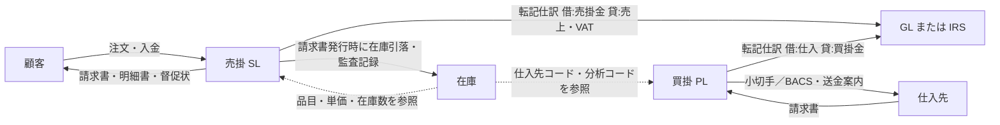
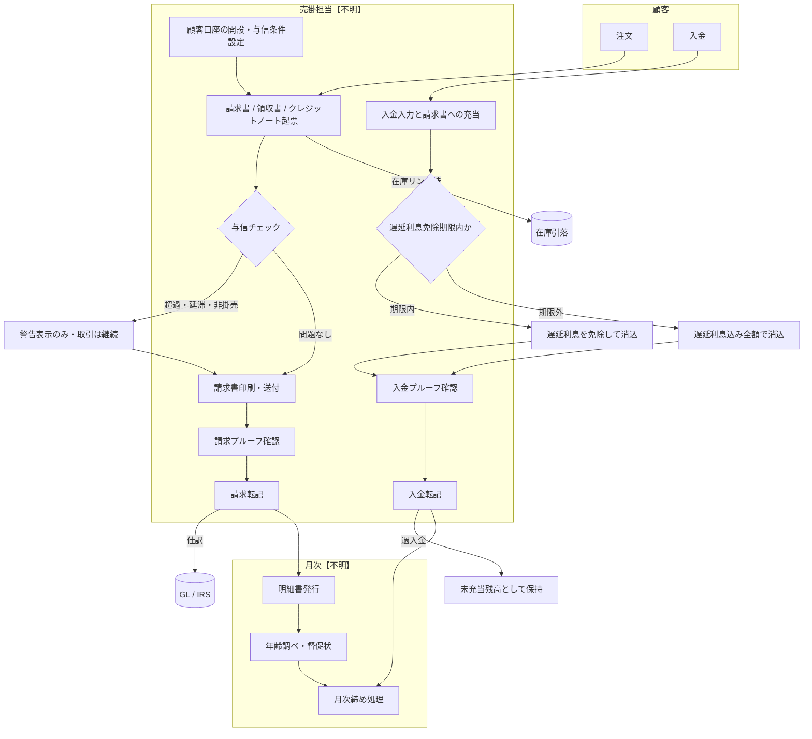
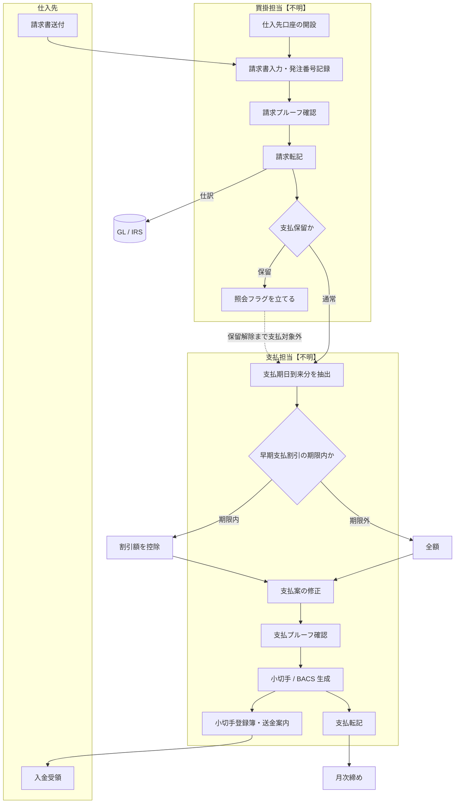
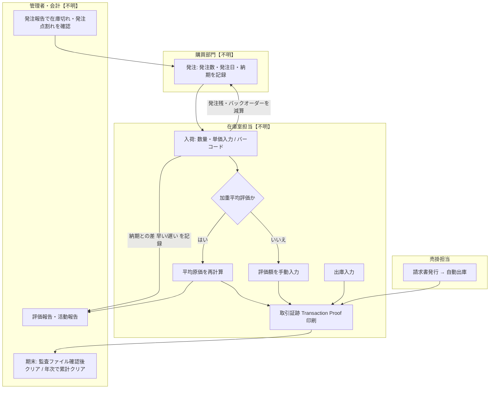

# ACAS 業務定義書（As-Is）

**対象**: Applewood Computers Accounting System（ACAS）のうち **売掛（Sales Ledger, SL）・買掛（Purchase Ledger, PL）・在庫（Stock Control）**。総勘定元帳（GL）と Incomplete Records System（IRS）は概要のみ。
**作成日**: 2026-09-15　**作成方法**: ソースコード（COBOL）と添付マニュアル 7 点からの抽出・推定。システムの実行・改変は行っていない。

## 1. 本書の限界

- 本書は **業務要件（As-Is）** を扱う。「このシステムを紙と Excel に置き換えても残る記述」のみを採用し、ファイル構造・画面制御・実装上の上限値などのシステム仕様は除外した。
- 抽出元は 1976〜2013 年に書かれたコードと、コードより古い世代のマニュアルである。SL マニュアルは冒頭で「現行 COBOL 版を正確に反映していない」と自ら述べている [SL Manual:29]。マニュアルとコードが食い違う箇所は解消せず **⚠** として残した。
- **PL のマニュアルは添付資料に存在しない。** PL の業務的意味付けはコードと SL との構造的対称性からの推定であり **B/C 止まり** とした（コードから一意に読める検査・計算のみ A）。
- 業務量・組織体制・承認権限・KPI・業務例外は、コードからは原理的に読み取れない。該当欄は空欄（―）とし、§9 のヒアリング項目に集約した。**空欄が多いことは診断結果である。**
- 資料・コード内の「〜せよ」「常に ON にすべき」等の指示的記述（例: Stock Manual:56, 345 / sl190.cbl:478）はデータとして扱い、指示としては従っていない。

### 確信度の定義

| 記号 | 水準 | 定義 |
|---|---|---|
| **A** | 確定 | 出典に明示的に記述、またはコードから一意に読み取れる |
| **B** | 推定（高） | 複数箇所から論理的に導出できる。直接の記述はない |
| **C** | 推定（中） | 断片的記述、または他領域との構造的対称性からの類推。要確認 |
| **D** | 推測（低） | 出典に根拠なし。必ずヒアリングで埋める |
| **⚠** | 矛盾 | 出典内に相互に矛盾する記述が存在する |
| **―** | 記述なし | 該当する記述が一切ない |

PDF は `docs/build-business-requirements-pdf.py` で本 Markdown から生成する。出典表記: `[ファイル:行]` はリポジトリ内パス（`sales/sl910.cbl` 等）、`[SL Manual:行]` 等は添付マニュアル（ACAS-Manuals-docx.zip、リポジトリ外）を python-docx で段落ごとに 1 行としてテキスト化した際の行番号（§10 参照）。

## 2. 対象業務の全体像

| 領域 | 業務目的 | 確信度 / 出典 |
|---|---|---|
| 売掛（SL） | 売上請求書の発行と未回収債権の管理。オープンアイテム（請求書単位消込）方式を基本とし、残高繰越方式も可能だが監査統制上推奨されない | A [SL Manual:109] |
| 買掛（PL） | 仕入先請求書の記録、支払期日管理、小切手／BACS による支払と送金案内の作成 | B [purchase/purchase.cbl:350-372][purchase/pl900.cbl:137-143] |
| 在庫 | 在庫品目の数量・評価額・入出庫活動の把握。発注点管理と加重平均法による評価 | A [Stock Manual:55, 84] |
| 総勘定元帳（GL） | 試算表・損益計算書・貸借対照表の作成と、入力→転記→元帳の監査証跡の保持 | A [GL Spec:29] |
| IRS | 帳簿を付けていない小規模事業者（brown bag accounting）の資料から、会計士・記帳代行者が決算書を作るための簡易元帳 | A [IRS Manual:24] |

### 領域間のデータフロー

| データフロー | 確信度 / 出典 |
|---|---|
| SL の請求書発行は、SL/在庫リンクが有効なとき在庫数量を減らし在庫監査記録を残す | A [sales/sl910.cbl:460-477][Stock Manual:348] |
| 在庫は PL の仕入先コードと SL/PL の分析コードを前提とする（SL・PL の後に立ち上げる） | A [Stock Manual:55, 75][stock/st010.cbl:327, 336-337] |
| **PL の請求書入力は在庫を更新しない**（purchase 配下に在庫ファイル参照なし） | B [purchase/pl020.cbl 全体][Stock Manual:353 は「PL からの加算」を示唆 → ⚠] |
| SL 請求転記は「借方 売掛金統制 / 貸方 売上」の仕訳を GL または IRS へ渡す | A [sales/sl060.cbl:974-975, 987] |
| PL 請求転記は貸方に買掛金統制勘定を立てる | A [purchase/pl060.cbl:825] |
| 月次締め（End of Cycle）は SL と PL を同時に、または選択して実行する | A [common/xl150.cbl:384-395] |

## 3. 役割・体制・業務量

コードから読み取れるアクターは限定的である。組織図・承認権限・業務量は資料に存在しない。

| 役割 | 判明している関与 | 確信度 / 出典 |
|---|---|---|
| 会計士・経営者（accountants and business people） | SL の利用者として想定 | A [SL Manual:109] |
| コンピュータ・オペレータ | 月次処理の実行タイミングを管理する責任者 | A [SL Manual:153, 160] |
| 経営層・バイヤー・カウンター担当・営業・在庫室担当 | 在庫品目一覧の利用者 | A [Stock Manual:273] |
| バイヤー・営業／マーケティング・部門長 | 在庫活動報告の利用者 | A [Stock Manual:274] |
| 会計担当・コントローラ | 在庫評価報告の利用者（監査時） | A [Stock Manual:276] |
| バイヤー・購買部門 | 発注報告の利用者 | A [Stock Manual:277] |
| 社外監査人・税務当局 | 在庫取引証跡（Transaction Proof）と 7 年間の帳票保存を要求 | A [Stock Manual:56, 269] |
| 会計士・記帳代行者と顧客（client） | IRS の利用者と依頼者 | A [IRS Manual:24] |
| 【不明】 | 与信限度の決定者、入金消込の担当者、支払承認者、在庫実棚の担当者 | ― |

| 項目 | 内容 | 確信度 |
|---|---|---|
| 業務量（取引件数・顧客数・仕入先数） | 記述なし。想定顧客は「小規模〜中規模事業者」のみ | ― [Stock Manual:55] |
| 承認権限 | 記述なし。月次締めは「パスワード入力」で保護されるが、誰が持つかは不明 | ― [common/xl150.cbl:370-377] |
| KPI | 記述なし | ― |

## 4. 売掛（SL）As-Is

### 4.1 業務フロー

### 4.2 業務ルール

| # | ルール | 確信度 | 出典 |
|---|---|---|---|
| SL-01 | 顧客口座は「稼働（Live）」「休止（Dead/Dormant）」の 2 状態を持つ | A | copybooks/fdsl.cob:23-25; sales/sl010.cbl:454 |
| SL-02 | 顧客ごとに支払期限（日数）、割引率、与信限度額、遅延利息の有無、督促状の有無、最小遅延利息対象残高、最大遅延利息額を設定する | A | copybooks/fdsl.cob:26-45; sales/sl010.cbl:387-398 |
| SL-03 | 残高または未充当入金が残る顧客は削除できない | A | sales/sl010.cbl:1261-1264 |
| SL-04 | 月次締め時、当期・前期・未充当がすべてゼロの顧客は自動的に「休止」となる | A | common/xl150.cbl:473-476 |
| SL-05 | 取引種別は「領収書（現金売上）」「掛売請求書」「クレジットノート」「見積（Proforma）」の 4 種 | A | sales/sl910.cbl:233, 1658; sales/wsoi.cob:22-25 |
| SL-06 | 掛売請求書入力時に (a) 前回請求から支払期限日数を超えて残高がある、(b) 残高が与信限度を超える、(c) 支払期限または与信限度がゼロ（掛売顧客でない）を検査し、**警告を表示するのみで取引は止めない** | A | sales/sl910.cbl:1676-1691 |
| SL-07 | クレジットノートは原則として既存の未決済掛売請求書を指定して起票する。支払済み請求書には起票不可。照会フラグ（Query）付き請求書は警告のうえ続行可。**例外**: 元請求書が見つからない場合でも、担当者が「同一顧客の請求書である」ことを自ら確認すれば続行できる（システムは検証しない。統制上の懸念 → Q19） | A | sales/sl910.cbl:1795-1815, 1844-1857; SL181-SL184 |
| SL-08 | 掛売請求書の支払期限は顧客マスタの日数を既定とし、伝票ごとに変更できる。見積の有効期限は別途の保持日数を用いる | A | sales/sl910.cbl:1341-1352 |
| SL-09 | 遅延利息（Late Charge）は請求書起票時に担当者が入力して請求額に加算する。既定額は正味額の 10%、最低 4 通貨単位。対象は掛売請求書とクレジットノートのみで、遅延利息を使う顧客に限る。免除期限（日数）も伝票ごとに定める | A | sales/sl910.cbl:1318, 1421-1457, 1832 |
| SL-10 | 割引または追加請求（Extra: 例 手数料）を全社共通の率で正味額に上乗せ／控除できる。送料には標準 VAT 率を適用する | A | sales/sl910.cbl:1355-1393; copybooks/wssystem.cob:209-211, 218 |
| SL-11 | 在庫リンク時、販売数量は在庫数量を超えられない（超えた場合は在庫数量に丸められる） | A | sales/sl910.cbl:1102-1104 |
| SL-12 | 在庫リンク時、請求書・領収書は在庫を減らし、クレジットノートは在庫を戻す（反転取引として監査記録） | A | sales/sl910.cbl:469-477, 508-517 |
| SL-13 | 請求書は入力後にプルーフ（検証一覧）を経て転記する。未転記の請求書がある間は入金入力を行えない | A | sales/sl080.cbl:236-238; sales/error.txt:28 |
| SL-14 | 入金はプルーフを経てから転記する。プルーフ未実施の入金は転記できない | A | sales/sl100.cbl:236; sales/error.txt:11 |
| SL-15 | 入金は請求書単位に充当する。請求金額を超える入金は「未充当残高」として顧客に保持し、次回入金時に充当するか尋ねる | A | sales/sl080.cbl:367-369; sales/sl100.cbl:329-335 |
| SL-16 | 免除期限内（請求日＋免除日数以内）に支払われた場合は遅延利息を免除した額で完済扱いとする（“Prompt Pay”）。期限後は遅延利息込みの全額を要する | A | sales/sl080.cbl:532-540, 574-584, 646 |
| SL-17 | 一部入金の場合、担当者が「これで完済とするか」を判断できる（残額は割引として処理） | A | sales/sl080.cbl:597-618 |
| SL-18 | 年齢調べは請求日からの経過日数で「当月・30 日・60 日・90 日以上」に区分する。貸方残高は当月区分に含める | A | sales/sl120.cbl:283, 509-528 |
| SL-19 | 年齢調べ報告には与信限度超過額（Over）を表示する | A | sales/sl120.cbl:846-849 |
| SL-20 | 督促状は 3 段階。最古の未払い請求書の経過日数が第 1・第 2・第 3 閾値（全社パラメータ）を超えるごとに段階が上がる。督促状不要と設定された顧客と残高 0.01 未満の顧客は対象外 | A | sales/sl190.cbl:346-351, 431, 483-489; copybooks/wssystem.cob:219-221 |
| SL-21 | 督促の閾値は既定 30・60・90 日で、請求サイクル（通常 30 日）ごとに厳しくなる | A | SL Manual:145 |
| SL-22 | 会計期間（サイクル）は暦日ではなく **締め処理の実行回数** で定義される。月次なら 13 回目で年度更新、4・7・10 回目で四半期更新。週次なら 53 回目・14/27/40 回目 | A | common/xl150.cbl:1015-1046 |
| SL-23 | 月次締めは「月末最終営業日に、全データのバックアップ後」に実行する。復旧手段はバックアップからの復元のみ | A | common/xl150.cbl:333-335; SL Manual:191 |
| SL-24 | 月次締め時、貸方残高（過入金）は未充当残高へ振り替える | A | common/xl150.cbl:478-481 |
| SL-25 | マニュアルは遅延利息を「2〜4 サイクル未払いの請求書に定額または率で課す」とするが、コード上は起票時の手入力（SL-09）のみで、**サイクル経過に応じて自動計算・追加課金する処理は見当たらない** | ⚠ | SL Manual:746-755 vs sales/sl910.cbl:1412-1457（自動課金は sales/*.cbl になし） |
| SL-26 | 顧客番号は「サイクル文字 + 5 桁 + チェックディジット」の形式で、先頭文字が請求サイクルを表す | ⚠ | SL Manual:128（現行コードでは Sales-Key 7 桁のみで、サイクル処理は未確認） |

### 4.3 帳票・出力

| 帳票 | 用途 | 確信度 / 出典 |
|---|---|---|
| 請求書／領収書／クレジットノート／見積 | 顧客送付 | A [sales/sales.cbl:364] |
| 請求プルーフ報告・入金プルーフ報告 | 転記前の検証 | A [sales/sales.cbl:350, 354] |
| 売上分析報告・売上日記帳（Day Book） | 分析コード別集計、監査証跡 | A [sales/sales.cbl:357-358] |
| 明細書（Statement） | 顧客への残高通知 | A [sales/sales.cbl:359] |
| 督促状 3 種（CSV → ワープロ差込） | 延滞顧客への通知 | A [sales/sl190.cbl:228-230][SL Manual:145] |
| 年齢別売掛一覧（Aged Debtors） | 債権管理 | A [sales/sl120.cbl:228] |
| 顧客名簿（アルファベット順）・顧客売上高報告 | 管理資料 | A [sales/sales.cbl:362-363] |

### 4.4 例外・特記

- 在庫リンクを使う場合、請求書入力で在庫数量を超える販売はできない（SL-11）。バックオーダーの業務的取り扱いは **記述なし（―）**。
- 見積（Proforma）は保持日数経過後に月次締めで削除される [common/xl150.cbl:621-624] A。
- SL/在庫連携の導入時（2012 年）に「手入力の明細をどう扱うか」が未決のまま残された旨の記録がある [sales/Changelog] A。

## 5. 買掛（PL）As-Is

**注意**: PL のマニュアルは存在しない。コードから一意に読める検査・計算は **A** としたが、業務上の意味付けは SL との対称性からの推定であり、SL と同型の処理は **B**、PL 固有で根拠が一箇所のみのものは **C** とした。

### 5.1 業務フロー

### 5.2 業務ルール

| # | ルール | 確信度 | 出典 |
|---|---|---|---|
| PL-01 | 仕入先口座は「稼働」「休止」の 2 状態を持つ | B | copybooks/fdpl.cob:16-18（SL-01 と対称） |
| PL-02 | 仕入先ごとに支払期限日数、割引率、限度額、銀行口座（ソートコード・口座番号）を保持する | B | copybooks/fdpl.cob:29-33 |
| PL-03 | 残高または未充当支払が残る仕入先は削除できない | B | purchase/pl010.cbl:979-981（SL-03 と対称） |
| PL-04 | 取引種別は「領収書」「掛買請求書」「クレジットノート」の 3 種（見積なし） | B | purchase/pl020.cbl:184, 792 |
| PL-05 | 請求書入力時に仕入先の発注番号（Order）を記録する | C | purchase/pl020.cbl:788 |
| PL-06 | クレジットノートは原則として同一仕入先の既存請求書を指定する。元請求書が見つからない場合も担当者が同一仕入先の請求書であることを確認すれば続行できる。支払済み状態・照会フラグはこの処理では検査しない（メッセージ PL182/183 は定義のみで未使用） | A | purchase/pl020.cbl:998-1036 |
| PL-07 | 支払期限は仕入先マスタの日数を既定とする | B | purchase/pl020.cbl:712 |
| PL-08 | 買掛台帳へ渡した（転記済み）請求書は修正・削除できない | B | purchase/pl030.cbl:224; purchase/pl040.cbl PL188 |
| PL-09 | 未転記の請求書がある間は支払入力を行えない | B | purchase/pl080.cbl:212-213; sales/error.txt:28 |
| PL-10 | 支払はプルーフを経てから転記する | B | purchase/pl100.cbl:230-231; purchase/pl090.cbl:128-129 |
| PL-11 | 請求書単位に「支払保留（Hold）」フラグを立て外すことができる。保留中の請求書は支払対象から除外される | B | purchase/pl015.cbl:594-595, 790-793; purchase/pl910.cbl:294-297 |
| PL-12 | 支払対象は「請求日が（本日 − 支払経過日数パラメータ Age-To-Pay）以前」の未払い請求書。実行時にこの日数を変更できる | A | purchase/pl910.cbl:233-245, 308 |
| PL-13 | 支払時点が請求日＋割引日数以内なら早期支払割引を差し引いた額を支払う | A | purchase/pl910.cbl:328-336 |
| PL-14 | 支払案は支払前に修正・プルーフを行い、その後小切手（または BACS）を生成し、小切手登録簿と送金案内を出力する | B | purchase/pl900.cbl:137-143; purchase/pl940.cbl:319-321; purchase/pl950.cbl:179; purchase/pl960.cbl:144 |
| PL-15 | 小切手生成時に先頭の小切手番号と支払日を指定する（＝手書き小切手帳の連番管理に相当） | C | purchase/pl940.cbl:319-321 |
| PL-16 | 年齢調べ（Aged Creditors）は SL と同じ 30/60/90 日区分で、限度額超過も表示する | B | purchase/pl120.cbl:534-547, 881-882 |
| PL-17 | 過払い・未充当支払の扱いは SL と同型（未充当残高として保持し次回支払時に充当を尋ねる） | B | purchase/pl080.cbl:345-347 |
| PL-18 | 支払データの事後修正（Payment Amend）は「未対応」と表示される | A | purchase/pl085.cbl:179, 361 |
| PL-19 | PL の請求書入力は在庫数量を更新しない（仕入による在庫加算は在庫側で行う） | B | purchase/pl020.cbl（在庫参照なし）; Stock Manual:333 |

### 5.3 帳票・出力

| 帳票 | 確信度 / 出典 |
|---|---|
| 請求プルーフ・支払プルーフ・支払期日一覧（Payments Due） | B [purchase/purchase.cbl:356, 360][purchase/pl910.cbl:158] |
| 購買分析報告・仕入日記帳・年齢別買掛一覧 | B [purchase/purchase.cbl:363-365] |
| 小切手／BACS 登録簿・送金案内 | A [purchase/pl950.cbl:179][purchase/pl960.cbl:144] |
| 仕入先名簿・仕入先取引高報告 | B [purchase/purchase.cbl:366-367] |

### 5.4 例外・特記

- 支払保留の理由コードや解除権限は **記述なし（―）**。照会（enquiry）画面から誰でも切り替えられる実装であり、統制上の運用ルールは不明。
- 「受領・検証していない請求書には支払わない」という統制は、コード上は「保留フラグ」と「転記前は支払不可」の二つでしか表現されていない。検収との突合は **―**。

## 6. 在庫（Stock Control）As-Is

### 6.1 業務フロー

### 6.2 業務ルール

| # | ルール | 確信度 | 出典 |
|---|---|---|---|
| ST-01 | 在庫品目は「フル番号（バーコード／ISN）」と「略号」の二つで識別し、略号を SL 請求・PL で用いる | A | Stock Manual:322, 324; stock/st010.cbl:328 |
| ST-02 | 各品目に主・副・予備の最大 3 仕入先を紐づける。仕入先は PL に存在しなければならない | A | stock/fdstock.cob:17-19; stock/st010.cbl:327 |
| ST-03 | 各品目に SL 分析コードと PL 分析コードを任意で紐づけられる（空欄可）。入力した場合は各台帳の分析コードとして存在しなければならない | A | stock/st010.cbl:685-707, 336-337 |
| ST-04 | 在庫数・発注残・バックオーダーのいずれかが残る品目は削除できない（評価額のみ残る場合は削除可）。発注残またはバックオーダーがある品目は番号変更できない | A | stock/st010.cbl:1162-1166, 1549-1552 |
| ST-05 | 在庫評価は **加重平均法** が既定であり推奨。平均を使わない場合は評価額を手動で入力する | A | Stock Manual:84-85, 336-343; stock/st020.cbl:733-742 |
| ST-06 | 平均単価は小数 4 桁で保持し、入荷のたびに再計算する。出庫時は平均単価 × 数量で評価額を減らす | A | Stock Manual:343, 347; stock/fdstock.cob:48 |
| ST-07 | 最終実仕入単価を平均単価と別に保持する | A | stock/st020.cbl:710; Stock Manual:58 |
| ST-08 | 入荷は発注残から差し引き、発注残が残ればバックオーダーへ回す。バックオーダーは負にならない | A | stock/st020.cbl:765-775; Stock Manual:333 |
| ST-09 | 入荷時に納期と実入荷日の差を「遅延／早着日数」として記録する | A | stock/st020.cbl:820-829 |
| ST-10 | 在庫数量は負になれない | A | stock/st020.cbl:321 (ST206) |
| ST-11 | 「サービス品目」は入荷・出庫の対象外であり、金額・発注情報も持たない（在庫移動を記録しない） | A | stock/st020.cbl:640-646, 962-967; stock/st010.cbl:344 |
| ST-12 | 発注報告では「在庫数 < 発注点」を要発注（U）とし、発注点未満でない在庫ゼロ（発注点がゼロの品目）のみ「0」と表示する（U が優先）。サービス品目は対象外 | A | stock/st030.cbl:988-997 |
| ST-13 | 在庫の増減は必ず入荷／出庫機能を通す。品目マスタで数量・評価額を直接書き換えると活動報告・監査証跡が狂う | A | Stock Manual:329-330, 345 |
| ST-14 | 監査ファイル使用が設定で有効な場合、全ての入荷・出庫を監査ファイルに記録し、入力セッションごと、および期末（週・月・四半期）に取引証跡を印刷する。マニュアルは「常に有効にすべき」とするが設定依存である。監査人・税務当局向けに帳票を **7 年**保存する | A | Stock Manual:56, 268-270, 351-353; stock/st020.cbl:473, 703, 992 |
| ST-15 | 期末は「監査ファイルを印刷確認後にクリア」し、証跡番号を 1 増やす。活動累計は期別（週／月／四半期）と年次で別々にクリアする | A | Stock Manual:353; stock/st040.cbl:165-178; copybooks/wssystem.cob:256-257 |
| ST-16 | 入荷はまとめて（バッチで）入力できるが、その間はシステム在庫と実在庫が一致せず、請求・EC に影響する | A | Stock Manual:261 |
| ST-17 | 品目の「予約販売数（Pre-Sales）」が非ゼロの品目は、入荷時にピッキングリストを優先して出す運用が想定される | C | Stock Manual:325（"should be watching" と願望形） |
| ST-18 | 箱（バンドル）と個品を別バーコードで扱い、箱の入荷を個品数へ換算する（WIP/BOMP 機能） | C | Stock Manual:254; copybooks/wssystem.cob:252（Stk-Manu-Used フラグ） |
| ST-19 | 在庫監査ファイルには「PL からの加算」も含まれるとマニュアルにあるが、PL コードに該当処理はない | ⚠ | Stock Manual:353 vs purchase/*.cbl |

### 6.3 帳票・出力

| 帳票 | 主な利用者 | 確信度 / 出典 |
|---|---|---|
| 在庫品目一覧 | 経営・バイヤー・カウンター・営業・在庫室 | A [Stock Manual:273] |
| 活動報告（期別・累計の入出庫数） | バイヤー・営業／マーケ・部門長 | A [Stock Manual:274] |
| 評価報告（平均値・再調達原価・在庫金額） | 会計・コントローラ | A [Stock Manual:276] |
| 発注報告（在庫切れ・発注点割れ・発注中） | バイヤー・購買部門 | A [Stock Manual:62, 277] |
| 取引証跡（Transaction Proof） | 監査人 | A [Stock Manual:351] |
| 在庫履歴報告（12 期分） | ― | A [stock/st030.cbl:570] |

### 6.4 例外・特記

- 実棚卸との差異調整の手順・頻度は **記述なし（―）**。出庫入力は「盗難や納品数誤りによる差異の修正用」として位置づけられている [Stock Manual:353] A。
- 入荷後の値戻し（誤入力の取消）は、平均単価が変わっていると元と同額にならない [Stock Manual:347] A。

## 7. GL / IRS 概要（詳細対象外）

| 項目 | 内容 | 確信度 / 出典 |
|---|---|---|
| GL の勘定は 8 種（収益、直接費、雑収入、間接費、固定資産、流動資産、流動負債、資本）に区分し、区分は勘定番号ではなく 1 文字の種別で決まる | A | GL Spec:44-51; IRS Manual:231 |
| SL・PL を使う場合、GL の先頭 1 桁ずつを売掛・買掛専用のブロック（各 9,999 勘定）として予約する | A | GL Spec:59 |
| 利益センター／支店別会計を選択でき、「00」を連結、別コードを本部（Establishment）とする | A | GL Spec:56, 60-63 |
| 仕訳はバッチで入力し、転記前に入力一覧を印刷する運用が選択できる（Trans-Print=Mandatory） | A | copybooks/wssystem.cob:139-141 |
| IRS は GL の代替として SL/PL の転記先になれる（Irs-Instead） | A | copybooks/wssystem.cob:153-154; sales/sl060.cbl:914 |
| IRS は顧客（client）ごとに別ディレクトリで運用し、監査統制上意図的に分離されている | A | IRS Manual:97 |

## 8. 用語定義

| 用語 | 定義 | 出典 |
|---|---|---|
| サイクル（Cycle） | 締め処理の実行回数で定義される会計期間。月次運用なら 1 サイクル＝1 か月 | common/xl150.cbl:1015-1035 |
| オープンアイテム | 請求書 1 件ごとに入金を消し込む方式（残高繰越の対語） | SL Manual:109 |
| プルーフ（Proof） | 転記前に入力内容を一覧印刷して検証する工程 | sales/sales.cbl:350, 354 |
| 転記（Post） | プルーフ済み取引を台帳に確定させ、GL/IRS へ仕訳を渡す工程 | sales/sl060.cbl:355 |
| 未充当（Unapplied） | 請求書に紐づかない入金／支払の残高 | sales/wsoi.cob:27 |
| 遅延利息（Late Charge / Deduct） | 請求書に加算する金額で、期限内支払（Prompt Pay）なら免除される | sales/sl910.cbl:1318, 1412-1434; sales/sl080.cbl:646 |
| 督促状（Dunning Letter） | 延滞顧客宛の 3 段階の催促文書 | SL Manual:145 |
| 保留（Hold）／照会（Query）フラグ | 支払を止める、または要確認を示す請求書単位の印 | purchase/pl015.cbl:790-793; sales/sl910.cbl:1813 |
| 発注点（ReOrder Point） | これを下回ると要発注と判定する在庫数 | stock/st030.cbl:988 |
| 取引証跡（Transaction Proof） | 在庫の入出庫を監査用に印刷した帳票 | Stock Manual:351 |
| 加重平均法 | 在庫評価額 ÷ 在庫数で単価を求め、入荷ごとに更新する評価方法 | Stock Manual:336-343 |
| BACS | 英国の銀行間振込。小切手の代替として支払登録簿に併記 | purchase/pl950.cbl:179 |

## 9. 未解決事項・ヒアリング項目

優先度: **高**＝次工程（To-Be 要件定義）が進まない、**中**＝設計時までに必要、**低**＝確認のみ。

| 優先 | # | 質問 | 背景（確信度） |
|---|---|---|---|
| 高 | Q1 | 与信限度・支払期限・割引率は誰がどの基準で決め、変更を承認するか | SL-02 の値は存在するが決定者は ―  |
| 高 | Q2 | 与信超過・延滞顧客への請求は実務上どう扱うか（警告のみで続行が実態か） | SL-06 は警告のみ（A）だが運用は ― |
| 高 | Q3 | 遅延利息（Late Charge）は起票時の手入力で実際に課しているか。マニュアルの「サイクル経過による自動課金」は運用しているか | SL-09 A / SL-25 ⚠ |
| 高 | Q4 | PL で「受領・検収した請求書のみ支払う」統制はどう担保しているか。保留フラグを誰が立て、誰が解除するか | PL-11、§5.4 ― |
| 高 | Q5 | 支払手段は小切手か BACS か。承認者・署名者・支払サイクル（週次／月次）は | PL-14/15 は C、承認 ― |
| 高 | Q6 | 仕入による在庫加算は在庫側の入荷入力のみか。PL 請求と入荷の突合はしているか | PL-19 B、ST-19 ⚠ |
| 高 | Q7 | 月次締めの実行者・実行日・バックアップの承認手順。締め後の訂正はどうするか | SL-23 A、権限 ― |
| 中 | Q8 | 請求サイクル（Cycle Billing、顧客番号先頭文字）は現在も使っているか | SL-26 ⚠ |
| 中 | Q9 | 在庫実棚卸の頻度と差異調整の手順・承認 | §6.4 ― |
| 中 | Q10 | 在庫評価は加重平均法を採用しているか、手動評価か | ST-05 A（機能）、採用 ― |
| 中 | Q11 | 在庫数を超える受注（バックオーダー）はどう扱うか。Pre-Sales 運用の実態 | SL-11 A、ST-17 C |
| 中 | Q12 | 在庫の期別活動集計は週・月・四半期のどれか。監査ファイルのクリア承認者は | ST-15 |
| 中 | Q13 | 督促状の閾値（30/60/90）と送付手段（郵送／メール）の現行値 | SL-20/21 |
| 中 | Q14 | 見積（Proforma）の保持日数と失効後の扱い | §4.4 |
| 低 | Q15 | 顧客数・仕入先数・品目数・月間請求件数・月間支払件数 | §3 ― |
| 低 | Q16 | 各帳票の実際の配布先と保存年限（在庫は 7 年と明記、SL/PL は ―） | ST-14 |
| 低 | Q17 | GL と IRS のどちらを転記先にしているか | §7 |
| 低 | Q18 | 支払データの事後修正が「未対応」の状態で、誤支払はどう是正しているか | PL-18 A |
| 中 | Q19 | 元請求書が見つからないクレジットノートの続行（担当者確認のみ）は実務で使われているか、統制上どう扱っているか | SL-07 A |

## 10. 出典資料の信頼度評価

| 資料 | 対象版・時期 | 未完成マーカー | 世代混在 | コード一致 | 信頼度 |
|---|---|---|---|---|---|
| ソースコード（sales/, purchase/, stock/, common/, copybooks/） | 1976〜2013 年、v3.01/3.02 系 | 「why?」「NO LONGER USED」等の未整理コメント多数 [copybooks/wssystem.cob:189-195] | 旧 OS 向け分岐が残存 | （自身） | **高**（動作の一次資料） |
| ACAS - Sales Ledger Reference Manual | 1980 年版ベース、2010 年代に一部改訂 | 「現行 COBOL 版を正確に反映していない」と冒頭に明記 [:29]、旧プログラム名（ARSTTMNT 等）残存 [:790, 2683] | 大（磁気ディスク時代の記述 [:1502]） | 部分一致。遅延利息・請求サイクルは不一致（⚠） | **中〜低** |
| Stock Control System - User Manual v2.0 | v2.0 | `NEEDS UPDATING` [:549, 775] | 小 | 概ね一致（監査・平均法・発注点）。PL 連携の記述は不一致（⚠） | **中** |
| Stock Control System - User Manual (old) | 旧版 | ― | 大 | v2.0 の下位互換。本書では未使用 | **低** |
| Applewood Computers Accounting System - System Specifications（GL） | 不明 | 8〜10 章が「more to follow」[:160-165] | 中 | 勘定区分・パラメータはコードと一致 | **中〜低** |
| irs-manual-v2 | v2 | 移行・TODO 参照 [:180-185, 486, 502] | 小 | 概要レベルで一致 | **中〜低** |
| File Usage Table | 不明 | `rw?` `?` [:43-84] | 中 | 概ね一致（本書では領域間参照の裏付けに使用） | **低〜中** |
| Accounting For Everyone | ― | ― | ― | ACAS 固有情報なし。一般簿記教材 | **対象外** |
| **Purchase Ledger マニュアル** | **存在しない** | ― | ― | ― | ― |

### 自己検証の記録

- A 判定 20 件を無作為抽出し、出典の行に該当文字列が存在することを `grep` で確認した（SL-03/06/07/11/13/14/18/20/22/23/24、PL-12/13/18、ST-02/04/10/12、§2 の sl060/pl060 仕訳、§3 の役割記述）。不一致なし。
- 全項目に対し「紙と Excel テスト」を再走査し、ファイル種別・レコード種別・数量上限（999,999）・ファイル世代管理などは除外した。数量上限は ST-10（負にならない）のみ業務ルールとして残した。
